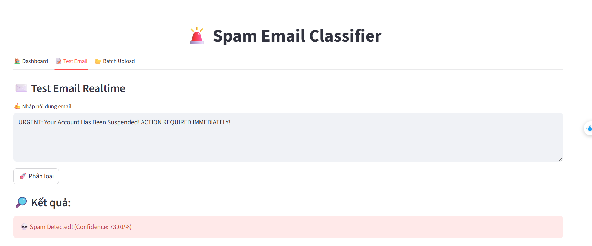
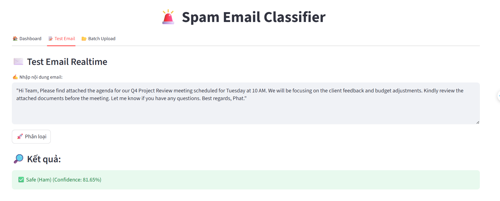

# 🚨 Email Classification: Spam/Ham Detection

## 📖 Giới thiệu

Đây là một mini-project về **Machine Learning** sử dụng thuật toán **Logistic Regression** để phân loại email là **Spam** hoặc **Ham** (không phải spam). Project được xây dựng nhằm mục đích học tập và thực hành về AI - Machine Learning.

## 🎯 Mục tiêu

- Xây dựng mô hình phân loại email tự động
- Áp dụng thuật toán **Logistic Regression** cho bài toán phân loại văn bản
- Sử dụng **TF-IDF Vectorizer** để chuyển đổi văn bản thành vector số
- Đánh giá hiệu suất mô hình với các metrics chuẩn
- Triển khai ứng dụng web đơn giản với **Streamlit**

## 📊 Dataset

- **Nguồn dữ liệu**: `email.csv`
- **Kích thước**: 5,158 email (sau khi loại bỏ trùng lặp)
- **Phân bố nhãn**:
  - **Ham** (Email thường): 4,516 emails (87.57%)
  - **Spam** (Email rác): 641 emails (12.43%)
- **Đặc điểm**: Dataset không cân bằng (imbalanced)

### Cấu trúc dữ liệu

| Category | Message |
|----------|---------|
| ham | "Go until jurong point, crazy.. Available only..." |
| spam | "Free entry in 2 a wkly comp to win FA Cup..." |

## 🛠️ Công nghệ sử dụng

### Thư viện Python

- **pandas**: Xử lý và phân tích dữ liệu
- **scikit-learn**: Xây dựng và đánh giá mô hình Machine Learning
- **matplotlib & seaborn**: Trực quan hóa dữ liệu
- **streamlit**: Xây dựng giao diện web
- **joblib**: Lưu và tải mô hình
- **re & string**: Xử lý và làm sạch văn bản

### Thuật toán & Kỹ thuật

1. **Logistic Regression**: Thuật toán phân loại chính
2. **TF-IDF Vectorizer**: Chuyển đổi văn bản thành vector số
3. **Text Preprocessing**: Làm sạch và chuẩn hóa dữ liệu văn bản
4. **Class Weight Balancing**: Xử lý dữ liệu mất cân bằng

## 📝 Quy trình thực hiện

### 1. Tiền xử lý dữ liệu

```python
def clean_text(text):
    text = text.lower()                          # Chuyển về chữ thường
    text = re.sub(f"[{string.punctuation}]", "", text)  # Xóa dấu câu
    text = re.sub(r"\d+", "", text)              # Xóa số
    return text
```

**Các bước xử lý**:
- Chuyển văn bản về chữ thường
- Loại bỏ dấu câu
- Loại bỏ số
- Xóa các dòng trùng lặp

### 2. Chia dữ liệu

- **Train set**: 80% (4,126 emails)
- **Test set**: 20% (1,032 emails)
- Sử dụng `stratify` để đảm bảo tỉ lệ Spam/Ham đồng đều

### 3. Vector hóa văn bản

Sử dụng **TF-IDF Vectorizer** để:
- Chuyển đổi văn bản thành vector số
- Tính toán tần suất từ và độ quan trọng của từ trong tài liệu
- Tạo feature matrix cho mô hình

### 4. Huấn luyện mô hình

```python
model = LogisticRegression(class_weight="balanced")
model.fit(X_train_tfidf, y_train)
```

**Tham số quan trọng**:
- `class_weight="balanced"`: Tự động điều chỉnh trọng số cho các lớp không cân bằng
- Giúp mô hình chú ý hơn đến lớp thiểu số (Spam)

## 📈 Kết quả

### Hiệu suất mô hình

- **Accuracy**: **96.41%** trên tập test

### Classification Report

```
              precision    recall  f1-score   support

Ham (0)         0.98      0.98      0.98       904
Spam (1)        0.86      0.85      0.85       128

accuracy                            0.96      1032
macro avg       0.92      0.92      0.92      1032
weighted avg    0.96      0.96      0.96      1032
```

### Confusion Matrix





**Phân tích**:
- Mô hình phân loại tốt email **Ham** với độ chính xác cao (98%)
- Độ chính xác phân loại **Spam** đạt 86%, chấp nhận được cho mô hình đầu tiên
- Ít false positive và false negative

## 🖥️ Giao diện ứng dụng

### Tính năng

1. **Dashboard**: 
   - Hiển thị thông tin tổng quan về mô hình
   - Biểu đồ phân bố Spam/Ham

2. **Test Email**: 
   - Nhập nội dung email để kiểm tra
   - Hiển thị kết quả phân loại và độ tin cậy
   - Highlight các từ khóa spam

3. **Batch Upload**: 
   - Upload file CSV chứa nhiều email
   - Phân loại hàng loạt
   - Hiển thị confusion matrix và biểu đồ
   - Download kết quả dưới dạng CSV

### Chạy ứng dụng

```bash
streamlit run app.py
```

Hoặc deploy trên Google Colab với ngrok:

```python
!ngrok authtoken "YOUR_TOKEN"
from pyngrok import ngrok
public_url = ngrok.connect(8501, "http")
!streamlit run app.py
```

## 📁 Cấu trúc thư mục

```
Email_Classification_Spam_Nospam/
│
├── email_classification.ipynb    # Notebook chính
├── email.csv                      # Dataset
├── app.py                         # Ứng dụng Streamlit
├── phanloaiemail.pkl             # Mô hình đã train
├── tfidf_vectorizer.pkl          # TF-IDF vectorizer
├── spam_dectected.png            # Ảnh demo spam
├── ham_detectedpng.png           # Ảnh demo ham
└── README.md                      # File này
```

## 🚀 Hướng dẫn sử dụng

### 1. Cài đặt thư viện

```bash
pip install pandas scikit-learn matplotlib seaborn streamlit joblib
```

### 2. Chạy notebook

Mở và chạy từng cell trong `email_classification.ipynb` theo thứ tự

### 3. Sử dụng mô hình đã train

```python
import joblib

# Load mô hình
model = joblib.load("phanloaiemail.pkl")
vectorizer = joblib.load("tfidf_vectorizer.pkl")

# Dự đoán
email = "Free money! Click here to win!"
email_vec = vectorizer.transform([email])
prediction = model.predict(email_vec)

print("Spam" if prediction[0] == 1 else "Ham")
```

## 🎓 Kiến thức học được

1. **Preprocessing văn bản**: 
   - Làm sạch và chuẩn hóa text
   - Regular Expression

2. **Feature Engineering**: 
   - TF-IDF vectorization
   - Chuyển đổi text thành số

3. **Machine Learning**:
   - Logistic Regression
   - Train/test split
   - Cross-validation
   - Xử lý imbalanced data

4. **Model Evaluation**:
   - Confusion Matrix
   - Precision, Recall, F1-Score
   - Accuracy

5. **Deployment**:
   - Streamlit
   - Model serialization
   - Web application design

## 🔮 Hướng phát triển

- [ ] Thử nghiệm với các thuật toán khác (Naive Bayes, SVM, Random Forest)
- [ ] Tăng cường preprocessing (stopwords removal, stemming, lemmatization)
- [ ] Xử lý imbalanced data tốt hơn (SMOTE, undersampling)
- [ ] Thêm feature engineering (n-grams, word embeddings)
- [ ] Deploy lên cloud platform (Heroku, AWS, Google Cloud)
- [ ] Xây dựng API RESTful
- [ ] Thêm tính năng phân tích chi tiết hơn

## 📝 Ghi chú

- Project này chỉ mang tính chất học tập
- Dữ liệu có thể cần được cập nhật để phù hợp với spam email hiện đại
- Mô hình cần được retrain định kỳ để duy trì hiệu suất

## 👨‍💻 Tác giả

Mini-project được xây dựng để học về AI - Machine Learning

---

**Happy Learning! 🎉**

